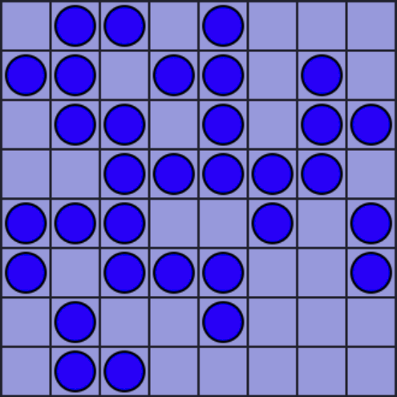

# Take Four
One player board game written in JavaScript

- take four consecutive coins in a row or column

- consecutive coins can be seperated by space

- click on the first and last coins to select

- click on the selected coin to cancel

- repeat until all conis are taken

[Play Take Four](https://mezoka.github.io/TakeFour)
